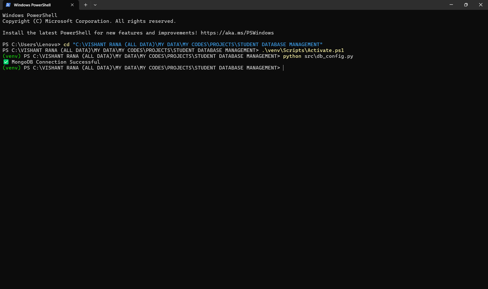
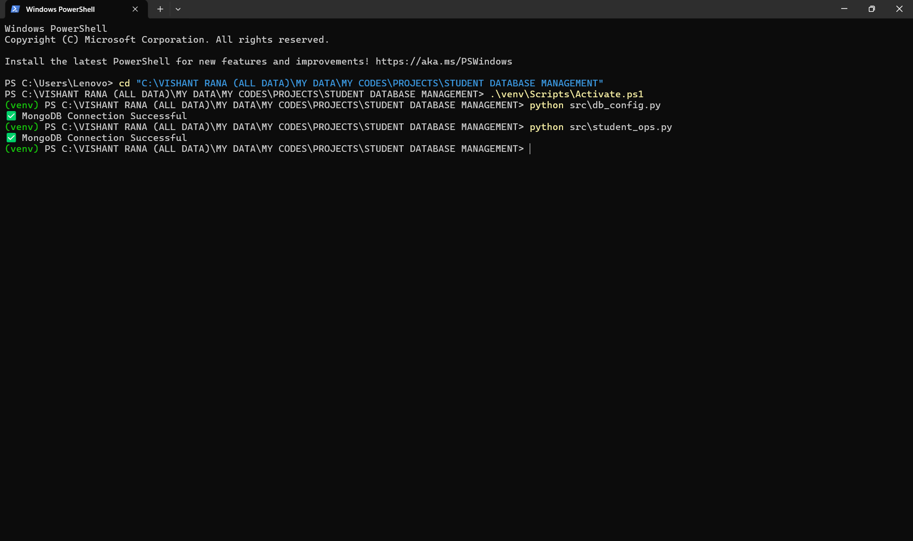
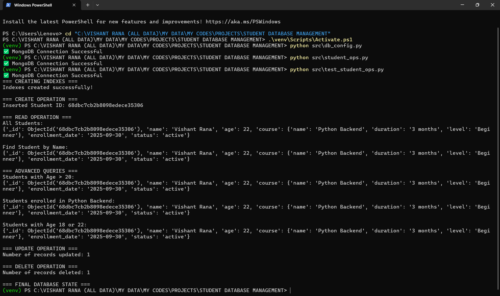

# 📚 Student Database Management (MongoDB)

## 📝 Description
# A backend application to manage student records using MongoDB.
# Supports CRUD operations, advanced query filtering, optimized schema, and indexing for faster retrieval.
# Designed with a focus on flexibility and NoSQL document structure.

## 🚀 Features
# - CRUD Operations → Create, Read, Update, Delete student records
# - Advanced Queries / Filtering:
#     * Filter by age ($gt, $in)
#     * Search by course name using regex
#     * Combine multiple query operators
# - Optimized Schema → Flexible structure for courses, enrollment date, and status
# - Indexing → Faster retrieval on commonly queried fields
# - Modular Python Code:
#     * db_config.py → Database connection setup
#     * student_ops.py → CRUD & query functions
#     * test_student_ops.py → Demo & testing script

## 📂 Project Structure
# STUDENT_DATABASE_MANAGEMENT/
# │
# ├── src/
# │   ├── db_config.py
# │   ├── student_ops.py
# │   └── test_student_ops.py
# │
# ├── screenshots/       # demo output images
# ├── .env               # MongoDB URI & credentials
# ├── requirements.txt   # Python dependencies
# └── README.md           # Project documentation

## ⚙️ Setup & Installation

# Step 1 – Clone Repository
git clone https://github.com/your-username/Student-Database-Management.git
cd Student-Database-Management

# Step 2 – Create Virtual Environment
python -m venv venv

# Activate Virtual Environment
# Windows:
# venv\Scripts\activate 
# Mac/Linux:
# source venv/bin/activate

# Step 3 – Install Dependencies
pip install -r requirements.txt

# Step 4 – Setup Environment Variables
# Create a .env file in project root with:
# MONGO_URI=mongodb://localhost:27017
# DB_NAME=student_db

# Step 5 – Run Demo Script
python src/test_student_ops.py

## 🖥️ Output Example

# ✅ MongoDB Connection Successful
# === CREATING INDEXES ===
# Indexes created successfully!
#
# === CREATE OPERATION ===
# Inserted Student ID: 68dba26fbb4065b757cc045f
#
# === READ OPERATION ===
# All Students:
# {'_id': ObjectId('68dba26fbb4065b757cc045f'), 'name': 'Vishant Rana', 'age': 22,
#  'course': {'name': 'Python Backend', 'duration': '3 months', 'level': 'Beginner'},
#  'enrollment_date': '2025-09-30', 'status': 'active'}
#
# Students with Age > 20:
# {'_id': ObjectId('68dba26fbb4065b757cc045f'), 'name': 'Vishant Rana', 'age': 22, ...}
#
# Students enrolled in Python Backend:
# {'_id': ObjectId('68dba26fbb4065b757cc045f'), 'name': 'Vishant Rana',
#  'course': {'name': 'Python Backend', ...}}
#
# === UPDATE OPERATION ===
# Number of records updated: 1
#
# === DELETE OPERATION ===
# Number of records deleted: 1
#
# === FINAL DATABASE STATE ===
# []

## 📸 Screenshots

# Database Config
# 

# Student Operations
# 

# Test Script (Demo Run)
# 

## 📝 Notes
# - Make sure MongoDB service is running before executing the scripts.
# - Store your MongoDB URI in the .env file to keep credentials private.
# - If running on Windows, use venv\Scripts\activate instead of source venv/bin/activate.
# - Database name used is student_db; you can change it in .env.
# - All screenshots are stored in the /screenshots folder for quick reference.
# - This README serves as a complete guide for setting up, running, and testing the Student Database Management project.
